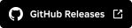

  

 

<strong>New era of Roblox website.</strong>

  <a href="#features">Features</a> •
  <a href="#installation">Installation</a>

  
  
  

  
  

<h2 id="features">Some features</h2>

<ul>
  <li>UI customization - sidebar styles, reimagned friend styling and more</li>
  <li>Verbs rename options like Marketplace/Catalog, Experiences/Games, Communities/Groups</li>
</ul>
<ul>
  <li>
    More coming soon!
  </li>
</ul>

<h2 id="installation">Manual installation</h2>

<ol>
  <li>Download the latest version of the project</li>
  <li>Open <code>chrome://extensions</code> in Chrome</li>
  <li>Enable <strong>Developer mode</strong></li>
  <li>Click <strong>Load unpacked</strong> and select this project folder (or <code>/dist</code>)</li>
</ol>

<h2>Sponsors and supporters</h2>

<!-- ALL-CONTRIBUTORS-LIST:START - Do not remove or modify this section -->
<!-- prettier-ignore-start -->
<!-- markdownlint-disable -->

<!-- markdownlint-restore -->
<!-- prettier-ignore-end -->

<!-- ALL-CONTRIBUTORS-LIST:END -->

**·** Thanks to meflamey for translating the project to Bengali language
 
**·** Thanks to Ryan Lua for helping me to afford Chrome Developer Account

<h2 id="contribution">Contribution</h2>
<ul>
  <li>You can contribute to the project by donating, translating or opening a pull request</li>
</ul>
  

  <ul>
    

      <h2 id="contribution">Localization</h2>
    

  </ul>
<ol>
  <li><a href="https://github.com/walway/RoPrime/fork">Fork</a> this project</li>
  <li>Navigate to the <code>/.locales</code> folder</li>
  <li>Create a folder with a <a href="https://wikipedia.org/wiki/List_of_ISO_639_language_codes">2-digit ISO 639 code</a> or open an existing one</li>
  <li>Use <code>example.md</code> in the <code>/.locales</code> folder for guidance. Copy and fill out the template, using the example to translate it into other languages</li>
  <li>After finishing, verify that your language code exists in <code>lang-config.js</code>. If it doesn't, add your <a href="https://wikipedia.org/wiki/List_of_ISO_639_language_codes">ISO 639 code</a> to the <code>subsets</code> constant, and the name of your language in its native tongue to the <code>langList</code> constant, for example: "English", "普通话", "Español"</li>
  <li>Open a pull request</li>
</ol>

 

  Built with ❤️

